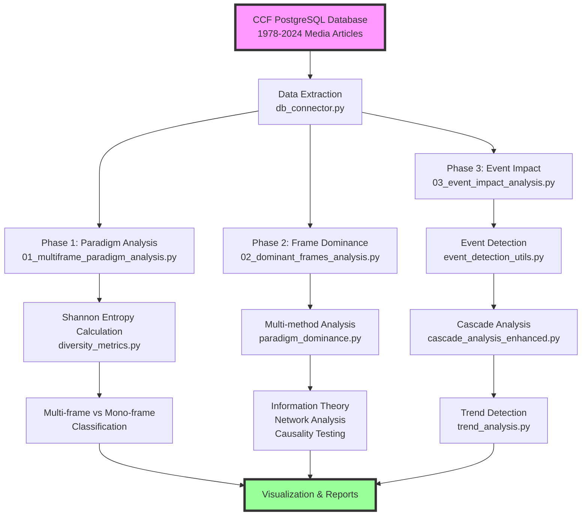

# CCF-paradigm: analyzing multi-frame climate communication dynamics in Canadian media

> **⚠️ Work in progress**: This repository is under active development. Code, analyses, and documentation are being continuously updated and refined. Results should be considered preliminary until the final publication.

## Abstract

This repository contains the analytical framework and computational tools for examining the paradigmatic structure of climate change framing in Canadian media discourse from 1978 to 2024. Building on the Canadian Climate Framing (CCF) database ([CCF-canadian-climate-framing](https://github.com/antoinelemor/CCF-canadian-climate-framing)), this project investigates whether climate communication follows a multi-frame paradigm, tracks frame dominance patterns over time, and analyzes the impact of focusing events on media cascade effects and paradigm shifts.

## Analysis pipeline overview



## Key research questions

1. **Paradigm structure**: does Canadian climate media follow a multi-frame or mono-frame paradigmatic structure?
2. **Frame dominance**: which frames dominate climate discourse across different temporal periods, and how do these dominance patterns evolve?
3. **Event impact**: how do focusing events trigger media cascades and influence paradigm shifts in climate framing?

## Methodology

### Data source

The analysis utilizes the CCF PostgreSQL database containing:
- **Temporal coverage**: February 1978 - December 2024
- **Media sources**: major Canadian newspapers and media outlets
- **Frame categories**: 8 primary frames (Political, Economic, Environmental, Cultural, Science, Security, Justice, Public Health)
- **Event detection**: named entity recognition and temporal clustering for event identification

### Analytical framework

#### 1. Multi-frame paradigm analysis
This phase tests whether Canadian climate discourse operates under a multi-frame paradigm (multiple competing interpretive frames) or a mono-frame paradigm (single dominant frame). The analysis uses information theory to quantify frame diversity:

- **Shannon entropy calculation**: quantifies frame diversity within weekly periods by measuring the uncertainty in frame distribution. Higher entropy (>0.333) indicates multi-frame characteristics
- **Effective frame count**: transforms entropy into an intuitive measure representing how many frames are actively contributing to the discourse (e.g., 4.47 frames means approximately 4-5 frames are equally active)
- **Statistical validation**: Wilcoxon signed-rank test confirms whether the median entropy significantly exceeds the mono-frame threshold
- **Temporal segmentation**: identifies distinct paradigm periods and transition points where the discourse structure fundamentally changes

#### 2. Frame dominance analysis
This phase determines which frames dominate climate discourse and how dominance patterns evolve over time. The analysis employs four complementary methods with equal weighting to avoid methodological bias:

- **Information theory (25% weight)**: calculates mutual information between frames to identify co-occurrence patterns and conditional entropy to measure frame interdependencies
- **Network analysis (25% weight)**: constructs temporal networks where frames are nodes and co-occurrences are edges, then applies PageRank and eigenvector centrality to identify influential frames
- **Causality testing (25% weight)**: uses Granger causality to detect if changes in one frame predict changes in another, and transfer entropy to measure information flow between frames
- **Proportional analysis (25% weight)**: tracks raw frame proportions and identifies when frames exceed dominance thresholds relative to historical baselines

#### 3. Event impact and cascade analysis
This phase analyzes how focusing events (major climate-related occurrences) trigger media cascades and influence paradigm shifts. The analysis distinguishes between event mentions and actual event occurrences:

- **Event detection**: uses DBSCAN clustering on temporal patterns to identify when event mentions spike simultaneously across multiple media outlets, indicating an actual event occurrence rather than routine coverage
- **Cascade identification**: tracks how frames spread across media outlets following events, analyzing source/messenger proportions, adoption sequences, and network diffusion patterns
- **Trend analysis**: applies Empirical Mode Decomposition (EMD) to decompose frame time series into intrinsic mode functions, identifying trends at multiple temporal scales without arbitrary thresholds
- **Impact quantification**: combines five sub-indices (journalist adoption, media diffusion, intensity, network topology, virality) to create comprehensive cascade scores and validate event impacts statistically

## Repository structure

```
CCF-paradigm/
├── scripts/                          # Analysis pipeline scripts
│   ├── 00_explore_database_structure.py      # Initial database exploration and schema documentation
│   ├── 01_multiframe_paradigm_analysis.py    # Calculates entropy metrics and paradigm classification
│   ├── 01_paradigm_visualization.py          # Creates statistical visualizations of paradigm results
│   ├── 02_dominant_frames_analysis.py        # Runs multi-method dominance analysis algorithms
│   ├── 02_dominant_frames_visualization.py   # Generates dominance pattern visualizations
│   ├── 03_event_impact_analysis.py           # Detects events and analyzes their impacts
│   ├── 03_media_cascade_analysis_enhanced.py # Identifies and scores media cascades
│   ├── 03_visualize_event_effects.py         # Creates event-cascade-frame flow diagrams
│   ├── 03a_trend_detection_data.py           # Performs EMD decomposition for trends
│   └── 03b_trend_aesthetic_visualization.py  # Produces publication-ready trend figures
│
├── src/                              # Core analytical modules
│   ├── database_access/
│   │   ├── db_connector.py          # PostgreSQL connection pooling and query optimization
│   │   └── data_processor.py        # Parallel data processing for large-scale analysis
│   ├── cascade_analysis_enhanced.py # Advanced cascade detection with multi-index scoring
│   ├── cascade_indices/             # Modular cascade measurement sub-indices
│   │   ├── base_index.py           # Abstract base class for cascade indices
│   │   ├── journalist_index.py     # Journalist adoption and influence patterns
│   │   └── __init__.py             # Package initialization
│   ├── diversity_metrics.py         # Shannon entropy and Hill numbers calculation
│   ├── event_detection_utils.py     # DBSCAN clustering for event identification
│   ├── paradigm_dominance.py        # Four-method dominance analysis implementation
│   ├── smoothing_utils.py           # LOWESS and Savitzky-Golay smoothing functions
│   └── trend_analysis.py            # EMD and fuzzy classification for trends
│
├── results/                          # Analysis outputs
│   ├── 01_paradigm_composition/     # Entropy distributions and paradigm classifications
│   ├── 02_dominant_frames/          # Dominance scores and temporal evolution charts
│   └── archives/                    # Previous analysis reports and validations
│
└── requirements.txt                  # Python dependencies
```


## Installation and usage

### Prerequisites
```bash
# Python 3.8+ required
pip install -r requirements.txt
```

### Database configuration
Create a `.env` file with PostgreSQL connection parameters:
```
DB_HOST=your_host
DB_PORT=5432
DB_NAME=ccf_database
DB_USER=your_user
DB_PASSWORD=your_password
```

### Running the analysis pipeline

The analysis should be run sequentially as each phase builds on previous results:

```bash
# Phase 0: Database exploration (optional, for understanding data structure)
python scripts/00_explore_database_structure.py
# Outputs: Database schema report, sample data, and column distributions

# Phase 1: Paradigm analysis - Test multi-frame vs mono-frame hypothesis
python scripts/01_multiframe_paradigm_analysis.py
# Calculates Shannon entropy for ~2000 weekly periods, performs statistical tests

python scripts/01_paradigm_visualization.py
# Creates comprehensive statistical summary figure with entropy distributions
# Outputs: results/01_paradigm_composition/Figure1_multiframe_test.png

# Phase 2: Frame dominance analysis - Identify dominant frames over time
python scripts/02_dominant_frames_analysis.py
# Applies four analytical methods to determine frame dominance patterns

python scripts/02_dominant_frames_visualization.py
# Generates temporal evolution charts and dominance heatmaps
# Outputs: results/02_dominant_frames/Figure1_dominance_analysis.png
#          results/02_dominant_frames/Figure2_temporal_evolution.png

# Phase 3: Event impact and cascade analysis - Analyze focusing events
python scripts/03_event_impact_analysis.py
# Detects event occurrences and quantifies their impacts on frame changes

python scripts/03_media_cascade_analysis_enhanced.py
# Identifies media cascades using multi-index scoring system

python scripts/03a_trend_detection_data.py
# Performs EMD decomposition to identify multi-scale trends

python scripts/03b_trend_aesthetic_visualization.py
# Creates publication-ready trend visualizations with significance indicators
# Outputs: Multiple trend analysis figures in results/03_events_effects/
```

## Related work

This project builds upon:
- **CCF database**: [CCF-canadian-climate-framing](https://github.com/antoinelemor/CCF-canadian-climate-framing)


